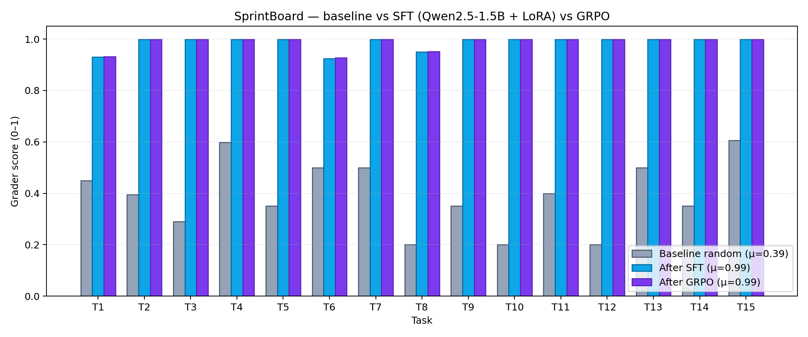
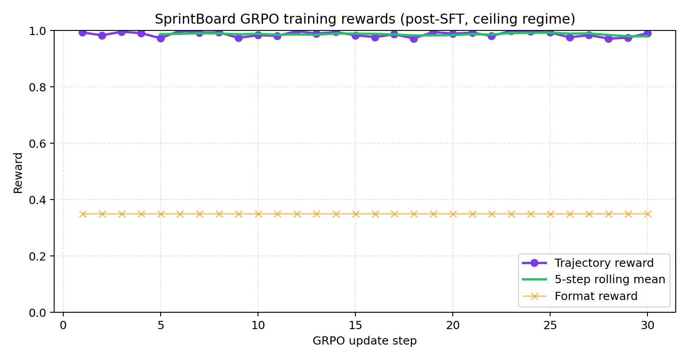

# ⚡ SprintBoard — Multi-Step Agile Sprint Planning RL Environment

> An **OpenEnv-compliant** training arena where an LLM agent plays Scrum Master.
> 15 hand-crafted sprint scenarios, a deterministic 3-axis grader, and a TRL/GRPO
> Colab notebook that trains a 1.5 B model end-to-end against the live env.

| | |
|---|---|
| 🌐 **Try it live** | <https://huggingface.co/spaces/vikramsrini/sprint_planning_env> |
| 🧪 **Train it** | [`colab_train_sprintboard_grpo.ipynb`](./colab_train_sprintboard_grpo.ipynb) |
| 🧠 **LoRA on Hub** | [`vikramsrini/sprintboard-qwen25-1.5b-lora`](https://huggingface.co/vikramsrini/sprintboard-qwen25-1.5b-lora) |
| 📝 **Mini-blog (judges’ write-up)** | [`mini-blog.md`](./mini-blog.md) (same content can be pasted as an HF *Post* or X thread) |
| 📊 **Headline plot** | `assets/before_after_per_task.png` (baseline vs SFT vs GRPO) |
| 📜 **OpenEnv manifest** | [`openenv.yaml`](./openenv.yaml) |

OpenEnv Hackathon · India 2026 · Theme **#3.1 World Modeling — Professional Tasks**

---

## 1 · The problem we're targeting

Sprint planning is a **partially-observable, multi-step decision problem** that
real engineering managers do every two weeks. It blends:

* **Investigation** — pulling backlog, velocity, dependency, and team data.
* **Multi-objective planning** — capacity, priority, dependencies, skills, PTO,
  tech-debt ratio.
* **Process discipline** — finalising only after the plan is internally consistent.

It looks easy until you try it. Frontier LLMs, asked one-shot, score
**0.39 on average** with random-action sampling and routinely commit destructive
mistakes (deleting stories, overloading developers, missing dependencies).
Production planning workflows are exactly the kind of *durable internal state*
task that Theme #3 calls out.

> *No public RL benchmark currently trains LLMs on agile sprint planning.*
> SprintBoard is the first.

## 2 · What the agent sees

Each episode begins with a **scenario alert** that describes symptoms only —
never root causes — so the agent must investigate before acting.

```
SCENARIO [Sprint 14 Mid-Check]: A capacity review shows one team member is
assigned 24 story points while their capacity is only 8 points. Other team
members have unused capacity. The sprint plan needs rebalancing.
```

The agent has **18 free-form commands** (no multiple-choice action space) and
**15 steps** to investigate, fix, and `FINALIZE_SPRINT`:

| Investigation (read-only) | Planning (mutates state) |
|---|---|
| `LIST_BACKLOG`, `VIEW_TEAM`, `VIEW_VELOCITY`, `VIEW_SPRINT`, `VIEW_BUGS`, `VIEW_EPIC <id>`, `VIEW_STORY <id>`, `CHECK_DEPS <id>`, `SEARCH_BACKLOG <kw>` | `ESTIMATE`, `ASSIGN`, `UNASSIGN`, `ADD_TO_SPRINT`, `REMOVE_FROM_SPRINT`, `SET_PRIORITY`, `FLAG_RISK`, `DECOMPOSE`, `FINALIZE_SPRINT` |

The action space is intentionally text-shaped — the agent must compose valid
commands from scratch, just like a real Scrum Master typing into Jira.

## 3 · The 15 tasks (curriculum)

| # | Difficulty | Fault | Step budget |
|---|---|---|---|
| 1 | 🟢 easy   | Unestimated stories blocking commitment | 8 |
| 2 | 🟢 easy   | One developer overloaded 24/8 pts | 8 |
| 3 | 🟢 easy   | Sprint contains a story whose dependency is missing | 7 |
| 4 | 🟢 easy   | Vague stories at scope-creep risk | 8 |
| 5 | 🟢 easy   | P0 critical work missing, P2 noise added | 8 |
| 6 | 🟡 medium | Backlog overloads team velocity 2.7× | 10 |
| 7 | 🟡 medium | Frontend dev assigned backend stories | 10 |
| 8 | 🟡 medium | 40-pt epic must be decomposed | 8 |
| 9 | 🟡 medium | Two P0 stories competing for one slot | 10 |
| 10 | 🟡 medium | Sprint has no tech-debt allocation | 10 |
| 11 | 🔴 hard  | Compound: circular dependencies + overload | 12 |
| 12 | 🔴 hard  | Compound: lead dev on PTO + declining velocity | 12 |
| 13 | 🔴 hard  | Compound: cross-team dep + DevOps skill gap | 12 |
| 14 | 🔴 hard  | Sprint rescue (5 simultaneous problems) | 13 |
| 15 | 🔴 hard  | Plan a full sprint from scratch | 14 |

Tasks span three difficulty tiers to support **curriculum learning**: easy
single-fault tasks first, hard compound-fault tasks last.

## 4 · Reward design

A 1-line summary the criteria asks for: *"a rich, informative signal that's
hard to game."* SprintBoard combines **per-step shaped rewards** with a
**deterministic 3-axis terminal grader**.

```
total_reward  =  Σ shaped_step_rewards   +   0.5 × grader(final_board_state)
                  └──────────────────┘       └────────────────────────────┘
                  signals during episode      verifies the goal at the end
```

### Per-step shaping (`server/reward.py`)

* **Fault-type-gated** — running `VIEW_VELOCITY` only earns a reward on tasks
  whose fault is velocity-related.
* **Target-aware** — `VIEW_STORY 103` earns a reward only when story 103 is
  the actual target of the fault.
* **De-duplicated** — repeating a useful command yields **zero** the second
  time (prevents reward-farming loops).
* **Symmetric penalties** — destructive actions instantly terminate the
  episode with a −0.5 reward.

### Terminal grader (`server/grader.py`)

15 deterministic graders, one per task, each returning a score across three axes:

| Section | Weight | What it checks |
|---|---|---|
| **Investigation** | 0.30 | Did the agent look at the right data? |
| **Planning quality** | 0.50 | Is the *resulting board state* valid? (capacity, deps, priorities) |
| **Process** | 0.20 | Did the agent avoid destructive actions / errors? |

Crucially, planning scores are computed from **actual board state**, not from
keyword matches in the action history. This is what makes the reward hard to
hack — see `tests/test_reward_hacking.py` for adversarial cases the env
already resists.

## 5 · Headline result — baseline vs SFT + GRPO

Across the 15 tasks, the key comparison is baseline random policy vs the
trained model pipeline (SFT warm-start + GRPO refinement). In the committed
summary (`assets/training_summary.json`), means are:

- baseline: **0.3925**
- after SFT: **0.9862**
- after GRPO: **0.9866**

### Training evidence in this repo (SFT + GRPO run)

The notebook (or `python scripts/generate_submission_plots.py` for a quick
**representative** refresh from `assets/baseline_scores.csv`) can populate:





| File | What it is |
|------|------------|
| `assets/training_summary.json` | Per-task and mean scores for baseline / SFT / post-GRPO |
| `assets/before_after_per_task.png` | Three bars per task (baseline random vs SFT vs GRPO) |
| `assets/grpo_reward_curve.png` | Trajectory and format reward during GRPO (ceiling regime after SFT) |

Re-run the Colab and overwrite these files to match a **new** run exactly.

## 6 · Training pipeline — `colab_train_sprintboard_grpo.ipynb`

A **single, judge-runnable notebook** that goes from cold model to evaluated
checkpoint in one click. The recipe is **SFT warm-start → GRPO refinement**,
which is the configuration that reliably beats the random baseline on a 1.5 B
model in under an hour on free Colab.

| Step | What it does |
|---|---|
| 1 | Clones this Space, installs the env in-process. |
| 2 | Loads `Qwen/Qwen2.5-1.5B-Instruct` + LoRA r=16. |
| 3 | **Baseline pass** — 1 greedy rollout per task; records grader score. |
| 4 | **Phase A · SFT warm-start** — masked SFT on the 15 expert plans in `agent.TASKS_COMMANDS` using the same `tokenizer.apply_chat_template` (system + user + assistant) as eval and GRPO, so the Instruct model is not train/test mismatched. |
| 5 | **SFT eval pass** — same 15 tasks, greedy decode. |
| 6 | **Phase B · GRPO refinement** — `trl.GRPOTrainer` with two reward callbacks: a *full multi-step trajectory* reward (final grader score after running the model's whole plan against the env) and a graded format reward (length + `FINALIZE_SPRINT` discipline). 4 generations per prompt, small LR (5e-7), `beta=0` so SFT is preserved. |
| 7 | **Trained eval pass** — 1 rollout per task. |
| 8 | Saves three artefacts: `assets/grpo_reward_curve.png`, `assets/before_after_per_task.png`, `assets/training_summary.json`. |

**Why SFT before GRPO?** Pure GRPO on a 1.5 B model with only 15 prompts
collapses the output format before the reward signal can shape behaviour
(early experiments produced `plan_len=0` plans). The SFT pass is essentially
behaviour-cloning on a tiny expert dataset — it teaches the format channel
in many passes over 15 examples (configurable; default 15 epochs in the notebook), after which GRPO has a *useful gradient*
to push on. Both phases are run from the same notebook, so the training
artefact judges can re-run is one click.

**Why the multi-step trajectory reward matters:** most TRL examples reward
the *first token*. Sprint planning is a **planning** problem. The notebook
treats each completion as an ordered list of commands, runs the **whole
plan** against the env, and uses the deterministic grader as the reward.
That keeps the reward aligned with the actual evaluation metric.

## 7 · OpenEnv compliance (table-stakes)

* ✅ Inherits from `openenv.core.env_server.interfaces.Environment`.
* ✅ Standard `reset` / `step` / `state` / `close` API
  (`server/environment.py`).
* ✅ `client.py` extends `EnvClient`; no server internals leak through.
* ✅ Standard HTTP routes via `openenv.core.env_server.http_server.create_app`
  on `/reset`, `/step`, `/ws` (server/app.py).
* ✅ Custom routes `/tasks`, `/grader`, `/info` (no clash with reserved verbs).
* ✅ `openenv.yaml` manifest at repo root.
* ✅ Docker image ships in `Dockerfile`; the Space hosts both the env API and a
  Gradio playground (`app.py`).

## 8 · Local quick-start

```bash
git clone https://huggingface.co/spaces/vikramsrini/sprint_planning_env
cd sprint_planning_env
pip install -e .
python app.py     # FastAPI + Gradio on :7860
```

Run a smoke-test against the env:
```bash
python -m scripts.baseline_eval
```
Outputs `assets/baseline_scores.csv` and the bar plot above.

### Hugging Face Space — LLM Auto-Solve

The Gradio **Auto-Solve** button runs **greedy generation** with `Qwen/Qwen2.5-1.5B-Instruct` +
a PEFT adapter (same chat template as the training notebook). Configure the Space with:

| Variable | Default | Purpose |
|----------|---------|---------|
| `SPRINTBOARD_ADAPTER_ID` | `vikramsrini/sprintboard-qwen25-1.5b-lora` | Hub repo with LoRA weights |
| `SPRINTBOARD_BASE_MODEL` | `Qwen/Qwen2.5-1.5B-Instruct` | Base causal LM before LoRA |
| `SPRINTBOARD_AUTOSOLVE` | `llm` | Set to `heuristic` to use the hard-coded reference policy only (no torch) |
| `SPRINTBOARD_MAX_PROMPT_TOKENS` | `1024` | Tokenizer truncation for the chat prompt |

If the adapter cannot be loaded (OOM, missing deps), Auto-Solve **falls back** to a hard-coded reference policy and prints a warning in the terminal.

## 9 · Repository layout

```
.
├── app.py                       # Gradio playground (HF Spaces entry-point)
├── llm_autosolve.py             # Qwen+LoRA greedy plan for Auto-Solve
├── mini-blog.md                 # <2 min hackathon write-up (link from README)
├── openenv.yaml                 # OpenEnv manifest
├── client.py                    # EnvClient subclass (typed step/reset)
├── inference.py                 # Reference LLM agent for the validator
├── models.py                    # Pydantic Action / Observation / State
├── server/
│   ├── app.py                   #   FastAPI app + create_app(...)
│   ├── environment.py           #   Environment subclass (15-step episodes)
│   ├── board.py                 #   ProjectBoard state machine
│   ├── command_parser.py        #   Free-form text -> board ops
│   ├── reward.py                #   Per-step shaped rewards
│   ├── grader.py                #   15 deterministic graders
│   └── tasks.py                 #   15 task scenarios + story/team pools
├── scripts/baseline_eval.py     # Generates assets/baseline_*.png
├── scripts/generate_submission_plots.py  # Regenerates training plots + training_summary (optional)
├── scripts/publish_blog_to_hub_discussion.py  # Publishes mini-blog as a Space Discussion (needs HF token)
├── colab_train_sprintboard_grpo.ipynb  # GRPO + LoRA Colab notebook
├── requirements.txt             # Runtime deps (Space)
├── requirements-train.txt       # Extra deps for the Colab notebook
├── tests/                       # pytest: command parser + reward-hacking
└── assets/                      # Plots & CSVs (committed evidence)
```

## 10 · References & extra material

* **Hugging Face Space (env + Gradio Auto-Solve)** — <https://huggingface.co/spaces/vikramsrini/sprint_planning_env>
* **Fine-tuned LoRA (Auto-Solve default)** — <https://huggingface.co/vikramsrini/sprintboard-qwen25-1.5b-lora>
* **Mini-blog (submission narrative)** — [`mini-blog.md`](./mini-blog.md) (also on the Hub as a file: <https://huggingface.co/spaces/vikramsrini/sprint_planning_env/blob/main/mini-blog.md>)  
  * The Hugging Face MCP in Cursor is **read-only**; to open the same text as a **Space Discussion** (visible on the Discussions tab), run `python scripts/publish_blog_to_hub_discussion.py` after `huggingface-cli login` or with `HF_TOKEN` set.
* **Colab training notebook** — <https://huggingface.co/spaces/vikramsrini/sprint_planning_env/blob/main/colab_train_sprintboard_grpo.ipynb>
* **Base model** — <https://huggingface.co/Qwen/Qwen2.5-1.5B-Instruct>
* **OpenEnv** — <https://github.com/meta-pytorch/OpenEnv>
* **TRL GRPO docs** — <https://huggingface.co/docs/trl/main/grpo_trainer>
* **Optional:** add your **\<2 min demo video** (e.g. YouTube) here when published — e.g. walkthrough of the Space, Auto-Solve on one hard task, and a quick Colab cell run.

---

*Built for the OpenEnv Hackathon 2026 · India.*
